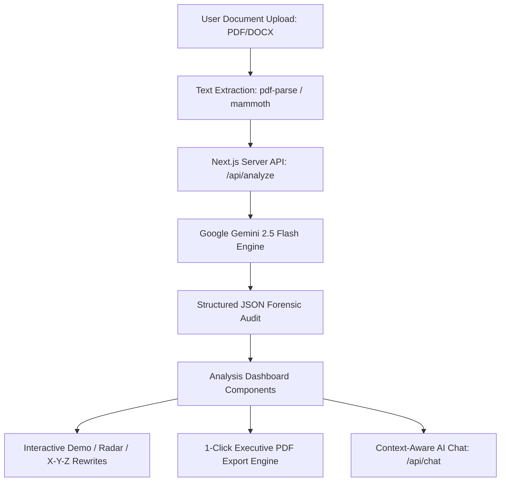

<div align="center">

  

  # 🧭 BOSSLA CAREER PRO
  ### Smart Resume Analyzer & Executive Career Co-Pilot

  [](https://nextjs.org/)
  [](https://www.typescriptlang.org/)
  [](https://deepmind.google/technologies/gemini/)
  [](https://tailwindcss.com/)
  [](https://www.framer.com/motion/)

  <p align="center">
    <b>Engineered & Architected by <a href="https://github.com/Bavly-Hamdy">Bavly Hamdy</a></b>
  </p>

  <p align="center">
    <i>An enterprise-grade, forensic ATS resume auditor, Google X-Y-Z formula impact rewriter, keyword gap detector, interactive career co-pilot, and executive PDF exporter.</i>
  </p>

</div>

---

## 🌟 Executive Overview

**Bossla Career Pro** (بوصلة الكاريير) is a state-of-the-art, full-stack web application designed to transform raw candidate resumes into high-converting job applications. Powered by **Google Gemini 2.5 Flash**, Bossla Career performs a line-by-line forensic audit to evaluate ATS readability, job match metrics, missing keyword gaps, interactive before-and-after bullet rewrites, tailored cover letters, salary benchmarking, and interactive interview coaching.

---

## ⚡ Core Feature Modules

### 1. 📊 Forensic ATS Audit & Radar Dimensions
- **4-Axis Metric Analysis**: Evaluates Impact & Metrics, Technical Skills Alignment, Brevity & Clarity, and Structure & Formatting.
- **Visual Radar Chart**: Interactive radar visualization generated in real time.
- **Key Strengths & Critical Flaws**: Highlights top candidate highlights and actionable red flags.

### 2. 🎯 Keyword Gap Detector & Formatting Checklist
- **Missing Skill Tags**: Extracts high-frequency technical and soft skill keywords missing from the candidate's resume relative to target Job Descriptions.
- **30+ Rule ATS Checklist**: Verifies section headers, font hierarchy, graphics compliance, and OCR readability.

### 3. 🪄 Google X-Y-Z Formula Bullet Rewriter
- **Impact Metrics Conversion**: Converts passive bullet points into high-converting impact metrics using Google's formula: `"Accomplished [X] as measured by [Y], by doing [Z]"`.
- **1-Click Copy**: Instant clipboard copying for effortless resume updates.

### 4. ✉️ AI Executive Cover Letter Generator
- **Tailored 3-Paragraph Format**: Generates bespoke executive cover letters aligned with the candidate's experience and target job.

### 5. 🚀 Career Trajectory & Salary Benchmarking
- **3 Promotion Tiers**: Predicts next-tier career promotion paths with timeframe estimates, market salary ranges (USD / local currency), and skill gap acquisition roadmaps.

### 6. 📄 100% Rebuilt ATS Markdown Resume
- **1-Click Export**: Compiles all improved bullet points into a pristine, parsable Markdown container ready for instant submission or download.

### 7. 🤖 Interactive Career Co-Pilot Sidebar
- **Context-Aware AI Chat**: Practice role-specific interview answers or refine bullet points with an AI assistant loaded with the candidate's full resume context.

### 8. 🖨️ Executive PDF Export & Vector Printing Engine
- **Direct 1-Click PDF File Download**: Integrated `html2pdf.js` engine generates downloadable `.pdf` files.
- **Vector Browser Printing**: Custom `@media print` rules with justified typography (`text-align: justify; text-justify: inter-word;`) and A4 page-break controls.

### 🌓 Premium Tactile Minimalist Design System
- **Dual Light / Dark Mode**: Full Monochrome high-contrast palette (`#ffffff` / `#000000`) with tactile matte surfaces (`.surface-matte`).
- **Bilingual (EN / AR) Support**: 100% Arabic translation with dynamic `dir="rtl"` layout alignment.

---

## 🏗️ Technical Architecture



---

## 🛠️ Technology Stack

| Layer | Technology | Description |
| :--- | :--- | :--- |
| **Framework** | Next.js 15 (App Router) | Server-side rendering, API routes, Turbopack bundling |
| **Language** | TypeScript | 100% strict type safety & schema validation |
| **AI Model** | Google Gemini 2.5 Flash | Structured JSON schema output via `@google/genai` |
| **Styling** | Tailwind CSS v4 | CSS variables, `@variant dark`, tactile surfaces |
| **Animation** | Framer Motion | Fluid micro-interactions & layout transitions |
| **PDF Engine** | html2pdf.js & CSS Print | 1-click vector PDF generation with justified text |
| **Parser** | pdf-parse & mammoth | Multi-format resume text extraction |
| **Icons** | Lucide React | Clean, modern iconography |

---

## 🚀 Getting Started

### Prerequisites
- Node.js 18.x or higher
- npm or pnpm

### Installation

1. **Clone the repository**:
   ```bash
   git clone https://github.com/Bavly-Hamdy/Bossla-Career.git
   cd Bossla-Career
   ```

2. **Install dependencies**:
   ```bash
   npm install
   ```

3. **Configure Environment Variables**:
   Create a `.env.local` file in the root directory:
   ```env
   GEMINI_API_KEY=your_gemini_api_key_here
   VITE_GEMINI_API_KEY=your_gemini_api_key_here
   ```

4. **Run the Development Server**:
   ```bash
   npm run dev
   ```
   Open [http://localhost:3000](http://localhost:3000) in your browser.

5. **Build for Production**:
   ```bash
   npm run build
   ```

---

## 👨‍💻 About the Author

<div align="left">

**Bavly Hamdy**
*Senior Full-Stack Software Engineer & AI Architect*

- 🌐 GitHub: [@Bavly-Hamdy](https://github.com/Bavly-Hamdy)
- 🚀 Project: [Bossla Career Pro](https://github.com/Bavly-Hamdy/Bossla-Career)
- 📧 Vision: Building world-class, tactile, high-performance web products powered by state-of-the-art AI models.

</div>

---

## 📜 License

This project is licensed under the MIT License - see the [LICENSE](LICENSE) file for details.

<div align="center">
  <sub>Built with ❤️ and precision by <b>Bavly Hamdy</b> • Powered by Google Gemini 2.5</sub>
</div>
